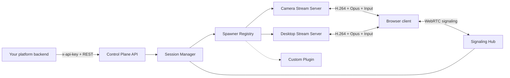

<div align="center">

# Tomo Streaming Control Plane

### Turn cameras, desktops and custom media sources into secure, interactive WebRTC sessions.

[](https://www.typescriptlang.org/)
[](https://webrtc.org/)
[](https://www.docker.com/)
[](LICENSE.md)

[Quick start](#quick-start) · [Public docs](https://tomo-docs.pages.dev) · [API](#api) · [Architecture](#architecture) · [Self-host](https://github.com/Tomo-Social/tomo-streaming-self-hosted) · [TypeScript SDK](https://github.com/Tomo-Social/tomo-streaming-sdk)

</div>

Tomo Streaming Control Plane is the orchestration layer behind interactive video, audio and input sessions. It creates isolated stream-server containers, issues separate host and player credentials, and relays WebRTC negotiation without owning your application users or product data.

> [!IMPORTANT]
> This repository is streaming infrastructure—not the Tomo social network. Accounts, profiles, friendships, messages, social rooms and feeds live outside this codebase.

## Why Tomo Streaming?

- **Interactive by default** — video, audio and low-latency input over WebRTC.
- **Source-agnostic** — camera and desktop today; emulators, capture cards and rendered applications through additional spawners.
- **Platform-neutral** — your product keeps identity, billing and permissions; Tomo returns a temporary session connection.
- **Cloud or self-hosted** — run Docker workers yourself or connect the same API to managed capacity.
- **Host isolation** — stream-server credentials never need to reach the player client.

## Architecture



The public boundary is intentionally small:

| This service owns | Your platform owns |
| --- | --- |
| Stream lifecycle and technical state | Accounts, profiles and organizations |
| Host/player session tokens | Authorization and billing rules |
| WebRTC offer/answer/ICE relay | Social rooms, memberships and feeds |
| Docker spawners and worker resources | Product UI and user-facing metadata |

## Quick start

### Requirements

- Node.js 22+
- Docker Engine with access to its socket
- A Linux worker for V4L2 camera or X11 desktop capture
- A 24+ character server-side API key

```bash
git clone https://github.com/Tomo-Social/tomo-streaming-control-plane.git
cd tomo-streaming-control-plane
npm install
npm test
npm run build

export TOMO_STREAM_API_KEY="replace-with-at-least-24-random-characters"
export AV_STREAM_SERVER_IMAGE="tomo-av-stream-server:local"
npm start
```

The service listens on `http://localhost:8090` by default.

```bash
curl http://localhost:8090/health
curl http://localhost:8090/api/v1/stream-servers
```

For a Docker Compose deployment, use [tomo-streaming-self-hosted](https://github.com/Tomo-Social/tomo-streaming-self-hosted).

## API

Discovery is public. Session operations require `x-api-key`.

| Method | Endpoint | Description |
| --- | --- | --- |
| `GET` | `/health` | Process health check |
| `GET` | `/api/v1/stream-servers` | Discover registered runtimes and capabilities |
| `GET` | `/api/v1/metrics` | Read session and connected-peer counters (API key required) |
| `GET` | `/api/v1/streams` | List sessions owned by the API client |
| `POST` | `/api/v1/streams` | Create a stream session |
| `GET` | `/api/v1/streams/:id` | Read live state and participant count |
| `POST` | `/api/v1/streams/:id/actions` | Pause, resume or restart |
| `DELETE` | `/api/v1/streams/:id` | Stop and remove the runtime |

Create a desktop session:

```bash
curl -X POST http://localhost:8090/api/v1/streams \
  -H "content-type: application/json" \
  -H "x-api-key: $TOMO_STREAM_API_KEY" \
  -d '{
    "type": "desktop-stream-server",
    "name": "Remote workspace",
    "config": {
      "display": ":0",
      "width": 1280,
      "height": 720,
      "fps": 30,
      "captureAudio": true
    }
  }'
```

The response exposes the player token in `session.connection`. The host token is injected directly into the stream-server container and is never returned to clients.

## Configuration

| Variable | Default | Purpose |
| --- | --- | --- |
| `PORT` | `8090` | HTTP and WebSocket port |
| `TOMO_STREAM_API_KEY` | — | Single server-side integration key |
| `TOMO_STREAM_API_KEYS` | — | JSON map of isolated client keys |
| `AV_STREAM_SERVER_IMAGE` | `tomo-av-stream-server:local` | Camera/desktop runtime image |
| `STREAM_SERVER_SIGNALING_URL` | local control plane | WebSocket URL used by runtime containers |
| `MAX_STREAM_SESSIONS` | `4` | Local concurrent-session limit |
| `EMPTY_SESSION_TIMEOUT_SECONDS` | `0` | Stop empty sessions after this idle period; `0` disables cleanup |
| `TOMO_STREAM_RATE_LIMIT` | `120` | Authenticated API requests per client per minute; `0` disables the local guard |
| `TOMO_STREAM_INSTANCE_ID` | `default` | Worker ownership boundary for container reconciliation |
| `CAMERA_DEVICE_HOST` | — | Host V4L2 device, such as `/dev/video0` |
| `X11_SOCKET_HOST` | — | Host X11 socket directory |
| `PULSE_SOCKET_HOST` | — | Host PulseAudio socket directory |
| `INPUT_SOCKET_HOST_DIR` | — | Host directory for isolated Unix input sockets |
| `PUBLIC_IP` / `TURN_*` | — | ICE and TURN connectivity settings |

`TOMO_STREAM_INSTANCE_ID` prevents one control plane from reconciling containers owned by another installation on the same Docker host.

## Project layout

```text
src/
├── http/          REST API and API-key boundary
├── sessions/      session lifecycle and runtime state
├── signaling/     WebRTC negotiation relay
├── spawners/      generic Docker contract + built-in sources
├── errors.ts
├── main.ts        composition root
└── types.ts       public service types
```

## Current status

The project is in **developer preview**. The local backend uses Docker and in-memory session leases. Horizontal production deployments will require a shared lease store and a worker scheduler; the HTTP, SDK and WebRTC contracts are designed to remain stable across that change.

## Ecosystem

| Repository | Role |
| --- | --- |
| [tomo-stream-server](https://github.com/Tomo-Social/tomo-stream-server) | C++ media runtimes for camera, desktop and Tomo Retro |
| [tomo-streaming-sdk](https://github.com/Tomo-Social/tomo-streaming-sdk) | TypeScript API and input client |
| [tomo-streaming-self-hosted](https://github.com/Tomo-Social/tomo-streaming-self-hosted) | Docker Compose deployment |

## License

Source-available under the [PolyForm Noncommercial License 1.0.0](LICENSE.md). Commercial embedding, hosted services, resale and commercial operation require a separate [Tomo commercial license](COMMERCIAL-LICENSE.md).

---

<div align="center"><strong>Built by Tomo for the next generation of shared interactive experiences.</strong></div>
